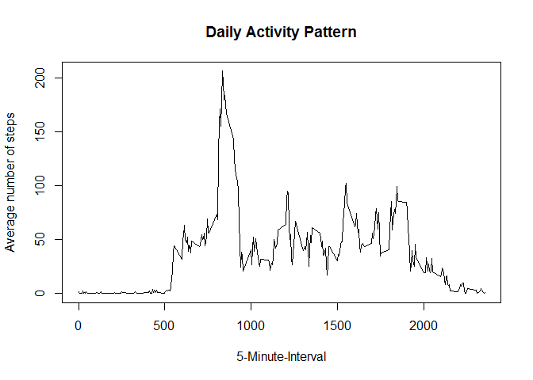
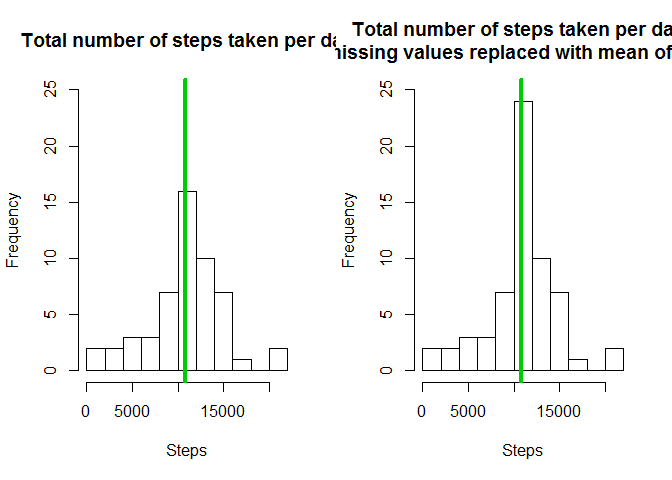
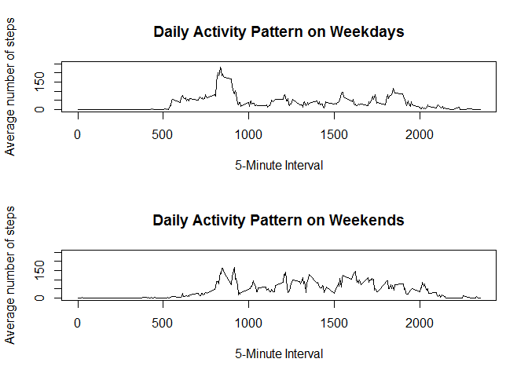

# Reproducible Research: Peer Assessment 1


## Loading and preprocessing the data
The data are compressed in a .zip file in the repository. We have to uncompress them and then load them to an R dataframe. 
Then we have a first look at the dataframe's structure.
We also check if we have missing recorded steps, by summing them.

```r
filename <- unzip("activity.zip")
activity <- read.csv(filename, stringsAsFactors = FALSE)
str(activity)
```

```
## 'data.frame':	17568 obs. of  3 variables:
##  $ steps   : int  NA NA NA NA NA NA NA NA NA NA ...
##  $ date    : chr  "2012-10-01" "2012-10-01" "2012-10-01" "2012-10-01" ...
##  $ interval: int  0 5 10 15 20 25 30 35 40 45 ...
```

```r
sum(is.na(activity$steps))
```

```
## [1] 2304
```
As the column "date" is not formatted as a Date class, we adjust it.

```r
activity$date <- as.Date(activity$date)
```
## What is mean total number of steps taken per day?
As we do not want to include records with missing values for answering some questions we create a new dataframe, in which the missing records are filtered out.

```r
activity_clean <- activity[which(!is.na(activity$steps)),]
```
After filtering out the missing records, we aggregate the counted steps by day.

```r
steps_by_day <- tapply(activity_clean$steps, activity_clean$date, sum)
```
We visualize our results in a histogramm, showing the frequency of summed daily steps over the whole observed period.

```r
hist(steps_by_day,10, main = "Total number of steps taken per day", xlab = "")  
```

 
  
Finally, we calculate the daily mean (=10766.19) and median (10765) of the steps.

```r
mean(steps_by_day)
```

```
## [1] 10766.19
```

```r
median(steps_by_day)
```

```
## [1] 10765
```
## What is the average daily activity pattern?
In order to explore activity patterns throughout the day, we will need to aggregate the dataset by the intervals. Therefore, we create a per interval array, visualized in a time series plot.

Please keep in mind that the x-axis point labels are the names of the intervals in the dataset. The coding of the interval names is such, so that e.g. 500 should be conidered as 5:00 and 1000 as 10:00, ans so on. So, one can consider th x-axis as a fuull 24-hour-day starting from midnight and ending at the next midnight hour.

```r
mean_steps_by_interval <- tapply(activity_clean$steps, activity_clean$interval, mean)
plot(y = mean_steps_by_interval, x = names(mean_steps_by_interval), type = "l", xlab = "5-Minute-Interval", main = "Daily Activity Pattern", ylab = "Average number of steps")
```

 
We then calculate the 5-minutes interval with the maximum daily average steps. 
This is the interval between 8:35 and 8:40 with 206.1698 steps on average.

```r
mean_steps_by_interval[mean_steps_by_interval==max(mean_steps_by_interval)]
```

```
##      835 
## 206.1698
```

## Imputing missing values
As discussed earlier in this report, there are a number os days/intervals where there are missing values (coded as NA). The presence of missing days may introduce bias into some calculations or summaries of the data.

Let's remind ourselves how many there were regarding the steps variable, and let's check that the other two variables do not have any missing data.

```r
sum(is.na(activity$steps))
```

```
## [1] 2304
```

```r
sum(is.na(activity))
```

```
## [1] 2304
```
The count of missing values for the column of steps equals to the total number missing in the whole dataset, so we can be sure that the intervals and the dates do not have any.

So, 2304 missing values is a percentage of 13.11% on the total observations, so obviously there will be some bias.

In order to exclude the bias we have to come up with a method for filling in all of the missing values in the dataset. Some quick ways are to use the mean/median for that day, or the mean for that 5-minute interval, etc.

We will go with the option of using the mean of the 5-minute interval, and thus we will now reate a new dataset that is equal to the original dataset but with the missing data filled in.

```r
act_new <- activity
act_new[which(is.na(act_new$steps)),1]<-
        mean_steps_by_interval[as.character(act_new[which(is.na(act_new$steps)),3])]
```
we proove again that there are no missing values in the dataframe anymore

```r
sum(is.na(act_new))
```

```
## [1] 0
```
Now let's draw the same histogram, that we made in the first part of the analysis, in order to proove if the missing values were significantly biasing the activity patterns.

```r
steps_by_day_new <- tapply(act_new$steps, act_new$date, sum)
par(mfrow=c(1,2))
hist(steps_by_day,10, main = "Total number of steps taken per day", xlab = "Steps"
     , ylim =c(0, 25))
abline(v = median(steps_by_day), col = 3, lwd = 4)
hist(steps_by_day_new,10, main = "Total number of steps taken per day  
     (missing values replaced with mean of interval)", xlab = "Steps",
     ylim =c(0, 25))
abline(v = median(steps_by_day_new), col = 3, lwd = 4)
```

 

  We then calculate the mean (=10766.19) and the median (=10766.19) of the filled in dataset

```r
mean(steps_by_day_new)
```

```
## [1] 10766.19
```

```r
median(steps_by_day_new)
```

```
## [1] 10766.19
```
The impact of inputting missing data is minimal, as only the median seems to be changing but by just over one step.

```r
mean(steps_by_day_new)-mean(steps_by_day)
```

```
## [1] 0
```

```r
median(steps_by_day_new)-median(steps_by_day)
```

```
## [1] 1.188679
```
## Are there differences in activity patterns between weekdays and weekends?
In this part of the assigment, we will create factor variable in the dataset with two levels - "weekday" and "weekend" indicating whether a given date is a weekday or weekend day.

```r
act_new$wd<-weekdays(act_new$date)
act_new$fwd<- as.factor(c("weekend", "weekday"))
act_new[act_new$wd == "Sunday" | act_new$wd == "Saturday" ,5]<- factor("weekend")
act_new[!(act_new$wd == "Sunday" | act_new$wd == "Saturday"),5 ]<- factor("weekday")
```
Now we will create two aggregated arrays for the total number of steps taken per 5-minyute time interval for weekdays and weekends, and make a graph in order to compare it there is a difference.

```r
act_new_we <- subset(act_new, fwd == "weekend") 
act_new_wd <- subset(act_new, fwd == "weekday") 
dailyact_we<-tapply(act_new_we$steps, act_new_we$interval, mean)
dailyact_wd<-tapply(act_new_wd$steps, act_new_wd$interval, mean)
par(mfrow=c(2,1))
plot(y = dailyact_wd, x = names(dailyact_wd), type = "l", xlab = "5-Minute Interval", 
     main = "Daily Activity Pattern on Weekdays", ylab = "Average number of steps", 
     ylim =c(0, 250))
plot(y = dailyact_we, x = names(dailyact_we), type = "l", xlab = "5-Minute Interval", 
     main = "Daily Activity Pattern on Weekends", ylab = "Average number of steps", 
     ylim =c(0, 250))
```

 
  
From the two graphs, we can clearly see that the distribution throughout the day is quite different. First of all, the individua from whom the measurements were taken, seem sto wake up at least one hour later at the weekends. Another interesting finding is that there is a huge amount of steps taken on weekdays, possibly while going to work or working out, which does not appear on Saturdays or Sundays. Generally, the whole weekend seems to be more evenly distributed with no huge deviations during hours when a normal person is expected to be awake and active. But, we can observe on average more steps during a weekend day, than on a "working" day. So, this individual is currently employed (or a volunteer), he/she does not take the car to and from work. As far as his/her job is concerned, he/she is not a teacher (as my teacher wife claims) or a waiter.

Please, once more, keep in mind that the x-axis point labels are the names of the intervals in the dataset. The coding of the interval names is such, so that e.g. 500 should be conidered as 5:00 and 1000 as 10:00, ans so on. So, one can consider th x-axis as a full 24-hour-day starting from midnight and ending at the next midnight hour.
